

  <!-- TOP HEADER BANNER -->
  

  <!-- DYNAMIC TYPING SUBHEADER -->
  

    
  

  <!-- QUICK INFO BADGES -->
  

    
    
    
    
  

 

<!-- SECTION 1: CLAUDE-PARTNER PROJECTS -->

  <table border="0" cellspacing="10" cellpadding="0" style="border: none; background: transparent; margin: 0 auto;">
    <tr style="border: none; background: transparent;">
      <td colspan="2" align="center" style="border: none; padding: 4px;">
        <a href="https://github.com/ViniciusSilva18/portifolio-estudo">
          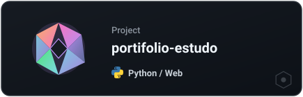
        </a>
      </td>
      <td align="center" style="border: none; padding: 4px;">
        <a href="https://github.com/ViniciusSilva18/Programa1">
          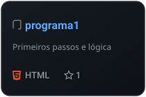
        </a>
      </td>
      <td align="center" style="border: none; padding: 4px;">
        <a href="https://github.com/ViniciusSilva18/viniciussilva18">
          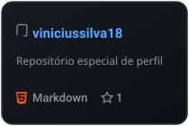
        </a>
      </td>
    </tr>
    <tr style="border: none; background: transparent;">
      <td align="center" style="border: none; padding: 4px;">
        <a href="https://github.com/ViniciusSilva18/chefinho-api">
          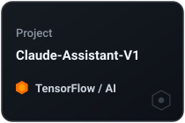
        </a>
      </td>
      <td align="center" style="border: none; padding: 4px;">
        <a href="https://github.com/ViniciusSilva18/projectmedia">
          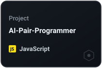
        </a>
      </td>
      <td align="center" style="border: none; padding: 4px;">
        <a href="https://github.com/ViniciusSilva18/aula2">
          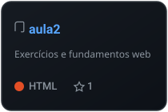
        </a>
      </td>
      <td align="center" style="border: none; padding: 4px;">
        <a href="https://github.com/ViniciusSilva18/projectmedia">
          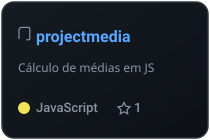
        </a>
      </td>
    </tr>
    <tr style="border: none; background: transparent;">
      <td colspan="2" align="center" style="border: none; padding: 4px;">
        <a href="https://github.com/ViniciusSilva18/netflix">
          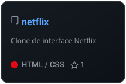
        </a>
      </td>
      <td colspan="2" align="center" style="border: none; padding: 4px;">
        <a href="https://github.com/ViniciusSilva18/ConserTech">
          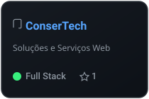
        </a>
      </td>
    </tr>
  </table>

 

<!-- SECTION 2: VINICIUS'S CREATIONS & ACTIVITY -->

  <!-- Activity Heatmap & Quadrant SVG -->
  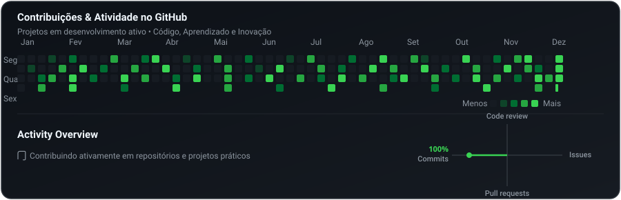

    

  <!-- Live Dynamic GitHub Streak Stats -->
  

 

<!-- SECTION 3: TECH STACK & TOOLS -->

  <h3>⚡ Tecnologias &amp; Ferramentas</h3>

  

    
    
    
    
    
    
    
    
    
    
  

 

---

  

    Feito com dedicação e foco em inovação contínua 🚀 • 
    <a href="https://github.com/ViniciusSilva18"><b>ViniciusSilva18</b></a>
  

